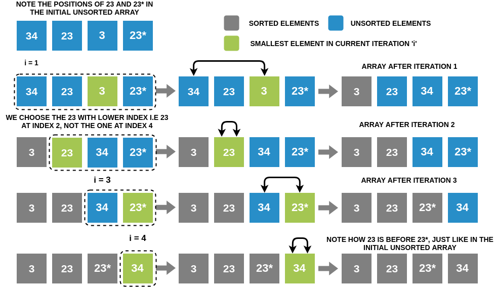

### What is a Stable Sort Algorithm?
A sorting algorithm is said to be stable if two objects with equal keys appear in the same order in sorted output as they appear in the input unsorted array. For example, look at the picture below. The unsorted array has two elements with value 23. Note the order of both these elements in the stable and unstable sorted arrays.

### Stable and Unstable sort

### Is Selection Sort Stable?
Yes, Selection Sort is a stable sorting algorithm. When looking for the smallest element, we choose the element with lower index incase there are two or more equal elements that are the smallest elements in the array. This makes sure that we preserve the relative ordering between equal elements.

Look at the picture below and keep and eye out for the ordering of 23 and 23*. Note how the original order of these elements is retained throughout the sorting process. The relative positioning of 23 and 23* does not change in the sorted output.

### Stability of Selection Sort

