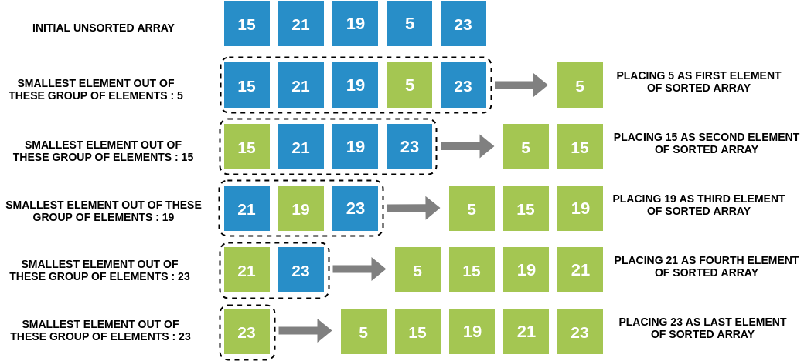
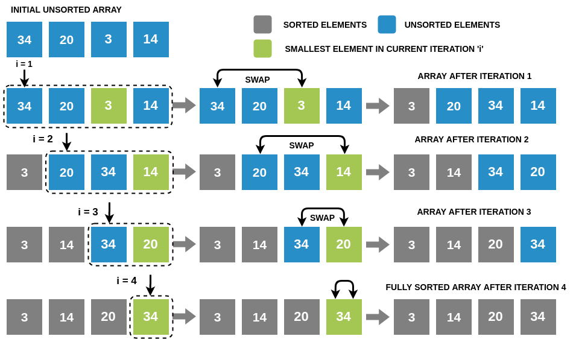

### How can we sort an array?

In Selection Sort, we take the simplest, most intuitive approach to sort an array. Choose the smallest number, place it in the first position. Then choose the next smallest number out of the remaining elements, and place it in the second position and so on till the end!
### Intuition Behind the Algorithm

### Selection Sort Algorithm

### Consolidated Algorithm for Selection Sort

Given an array of N elements, run N-1 iterations.
In iteration i (1≤i≤N-1):

  -  Find the smallest element with the least index, such that **index≤i≤N-1**.
  -  Swap the smallest element found with element at index **i**.

