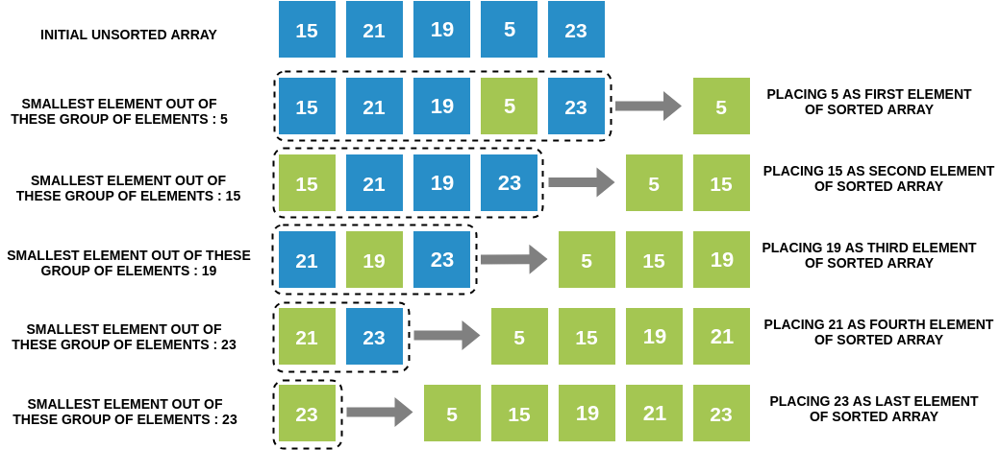

### Selection Sort Algorithm

<iframe src="https://www.youtube.com/embed/49LPQB246wY" frameborder="0" allow="autoplay; encrypted-media" allowfullscreen></iframe>

### How can we sort an array?

In Selection Sort, we take the simplest, most intuitive approach to sort an array. Choose the smallest number, place it in the first position. Then choose the next smallest number out of the remaining elements, and place it in the second position and so on till the end!

### Intuition Behind the Algorithm



### Step-by-Step Example

Suppose we want to sort the array: [29, 10, 14, 37, 13]

1. **First iteration:**

- Find the smallest element (10) and swap it with the first element.
- Array becomes: [10, 29, 14, 37, 13]

2. **Second iteration:**

- Find the smallest in the remaining [29, 14, 37, 13] (which is 13) and swap with 29.
- Array becomes: [10, 13, 14, 37, 29]

3. **Third iteration:**

- Find the smallest in [14, 37, 29] (which is 14, already in place).
- No swap needed. Array remains: [10, 13, 14, 37, 29]

4. **Fourth iteration:**

- Find the smallest in [37, 29] (which is 29) and swap with 37.
- Array becomes: [10, 13, 14, 29, 37]

5. **Fifth iteration:**

- Only one element left, array is sorted.

### Pseudocode for Selection Sort

```javascript
function selectionSort(arr) {
  let n = arr.length;
  for (let i = 0; i < n - 1; i++) {
    let minIdx = i;
    for (let j = i + 1; j < n; j++) {
      if (arr[j] < arr[minIdx]) {
        minIdx = j;
      }
    }
    // Swap arr[i] and arr[minIdx]
    [arr[i], arr[minIdx]] = [arr[minIdx], arr[i]];
  }
}
```

### Tips and Common Mistakes

- Always swap even if the minimum is already at the current position (it’s a no-op, but keeps logic simple).
- When there are duplicate values, always pick the one with the lowest index to maintain stability.
- Don’t forget to update the minimum index inside the inner loop.
- The last element does not need to be checked; it will already be in place after N-1 iterations.

### Key Takeaways

- Selection Sort repeatedly selects the minimum element and moves it to the sorted portion of the array.
- It performs well on small arrays but is inefficient for large datasets (O(N²) time complexity).
- It is an in-place, comparison-based, and stable sorting algorithm.
- Each iteration guarantees that the next smallest element is placed in its correct position.
